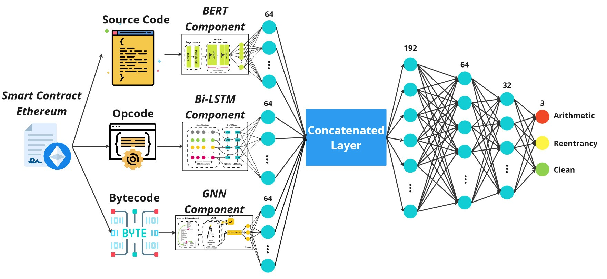

# Abtract
This paper presents VulnSense framework, a comprehensive approach to efficiently detect vulnerabilities in Ethereum smart con-
tracts using a multimodal learning approach on graph-based and natural language processing (NLP) models. Our proposed frame-
work combines three types of features from smart contracts comprising source code, opcode sequences, and control flow graph
(CFG) extracted from bytecode. We employ Bidirectional Encoder Representations from Transformers (BERT), Bidirectional Long
Short-Term Memory (BiLSTM) and Graph Neural Network (GNN) models to extract and analyze these features. The final layer of
our multimodal approach consists of a fully connected layer used to predict vulnerabilities in Ethereum smart contracts. Address-
ing limitations of existing vulnerability detection methods relying on single-feature or single-model deep learning techniques, our
method surpasses accuracy and effectiveness constraints. We assess VulnSense using a collection of 1.769 smart contracts derived
from the combination of three datasets: Curated, SolidiFI-Benchmark, and Smartbugs Wild. We then make a comparison with
various unimodal and multimodal learning techniques contributed by GNN, BiLSTM and BERT architectures. The experimental
outcomes demonstrate the superior performance of our proposed approach, achieving an average accuracy of 77.96% across all
three categories of vulnerable smart contracts.

# Multimodal in VulnSense Framework


# Cite
```[@INPROCEEDINGS{Multimodal_Globecom,
AUTHOR="Le Cong Trinh and Kien Trung Vu and Hoang Minh Trinh and Quyen Huu Nguyen
and Nghi {Hoang Khoa} and Phan The Duy and Van-Hau Pham",
TITLE="A Multimodal Deep Learning Approach for Efficient Vulnerability Detection
in Smart Contracts",
BOOKTITLE="2023 IEEE Global Communications Conference: Communication \& Information
Systems Security (Globecom 2023 CISS)",
ADDRESS="Kuala Lumpur, Malaysia",
PAGES=6,
DAYS=3,
MONTH=dec,
YEAR=2023,
KEYWORDS="Deep learning; Multimodal; Blockchain; Smart contract; Vulnerability
Detection",
ABSTRACT="In this paper, we present a comprehensive approach for efficient
vulnerability detection in Ethereum smart contracts using a multimodal deep
learning (DL) approach. Our proposed approach combines two levels of
features in smart contracts, including source code, bytecode, and utilizes
BERT and Bi-LSTM models to extract and analyze the features. The last layer
of our multimodal approach is a fully connected layer that predicts the
vulnerability in Ethereum smart contracts. We address the limitations of
existing deep learning-based vulnerability detection methods for smart
contracts, which often rely on a single type of feature or model, resulting
in limited accuracy and effectiveness. The experimental results show that
our proposed approach achieves superior results compared to existing
state-of-the-art methods, demonstrating the effectiveness and potential of
multimodal DL approaches in smart contract vulnerability detection"
}]
 
